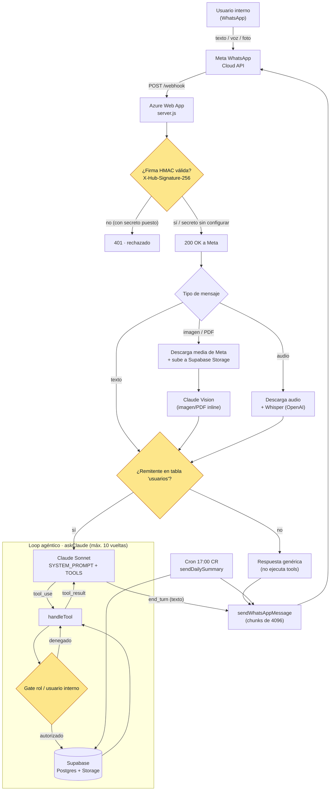
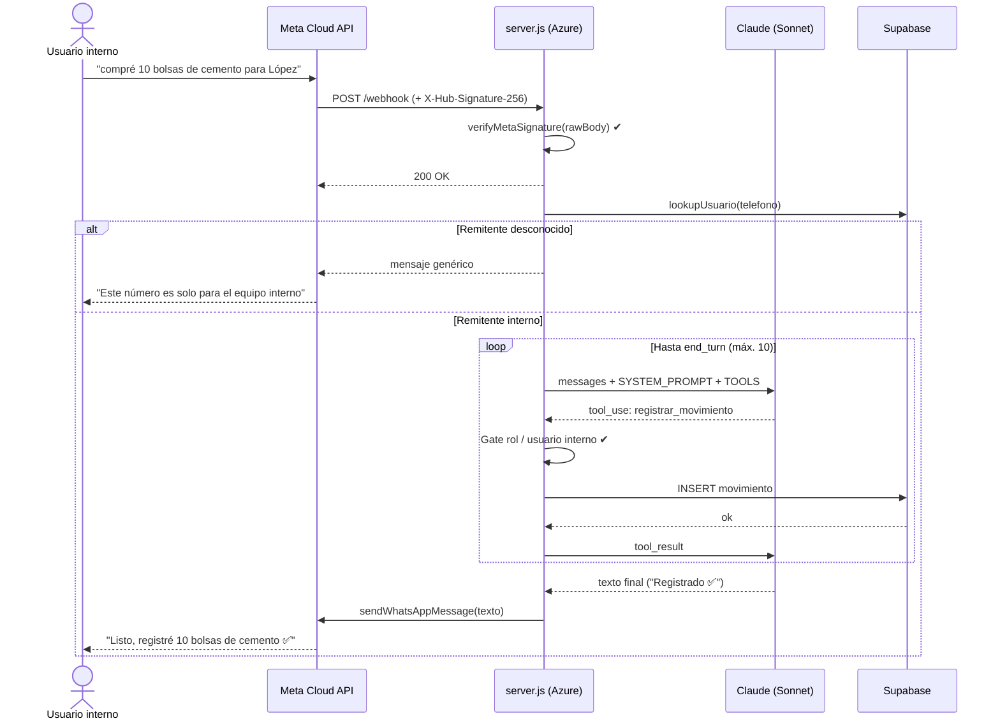
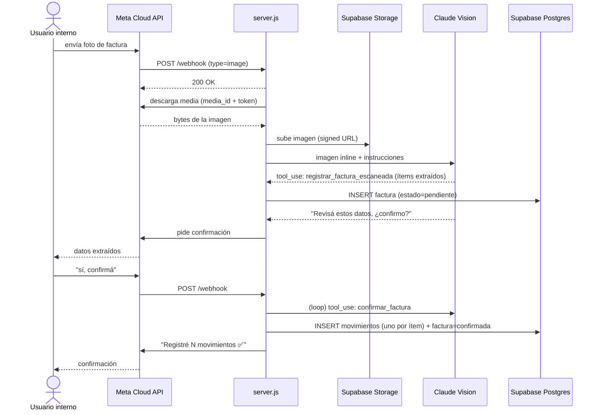
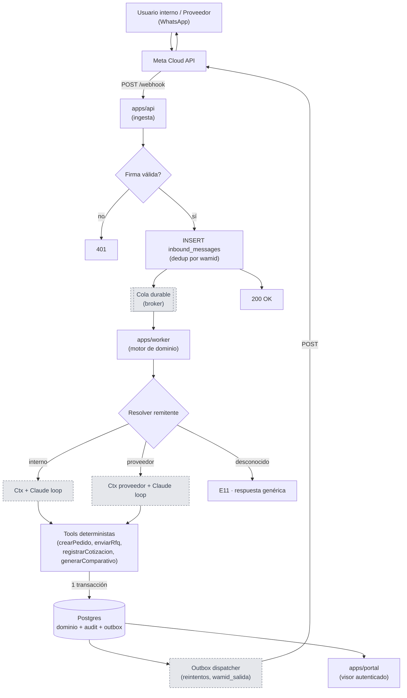

# Diagramas de flujo

Diagramas del sistema WhatsApp de proveeduría de la empresa constructora. Renderizan en
GitHub / VS Code (Mermaid). Dos vistas:

1. **Prototipo legado** (`server.js`) — lo que está **vivo hoy**, ya con el endurecimiento
   de seguridad aplicado (verificación de firma, gate de remitente, gate de usuario interno).
2. **Sistema objetivo (Módulo 1)** — la arquitectura hacia la que va el producto nuevo
   (`apps/*` + `packages/*`), aún no desplegada.

> Los nodos en **amarillo** son los controles de seguridad agregados en el endurecimiento
> del prototipo (ver `docs/PILOT_VALIDATION_COOKBOOK.md §2.2`).

---

## 1. Prototipo legado — arquitectura y flujo (estado actual, endurecido)

**Notas del prototipo legado:**
- Un solo proceso, un solo archivo (`server.js`), sin cola ni worker.
- Responde `200 OK` y **procesa de forma asíncrona** (fire-and-forget).
- Estado de conversación en un `Map` **en memoria** (se pierde al reiniciar).
- Envíos sin reintento; el cron corre dentro del mismo proceso web.
- **Solo flujo interno**: registrar materiales, escanear facturas, pagos a contratistas,
  dashboards. **No hay flujo de proveedor.**

---

## 2. Prototipo legado — secuencia de un mensaje de texto

---

## 3. Prototipo legado — secuencia de una foto de factura

---

## 4. Sistema objetivo (Módulo 1) — arquitectura hacia la que va el producto

> Aún **no desplegado**. Separa ingesta segura, procesamiento y envío en piezas distintas,
> con auditoría append-only y outbox con reintentos. Incluye el **flujo de proveedor**
> (RFQ → cotización → comparativo) que el legado no tiene.

**Nodos punteados**: piezas que existen como diseño/librería pero **aún no están cableadas**
en un proceso corriendo (broker real, sender real de Meta, adaptador de Claude, extractores).
Ver `docs/PILOT_VALIDATION_COOKBOOK.md §6` y `docs/handoff/FASE2A-current-status.md`.

---

## Leyenda

| Elemento | Significado |
|---|---|
| 🟨 Amarillo (legado) | Control de seguridad agregado en el endurecimiento del prototipo |
| ⬜ Punteado (objetivo) | Pieza del sistema nuevo aún no cableada en runtime |
| `(...)` | Nombre de función/archivo real en el código |
